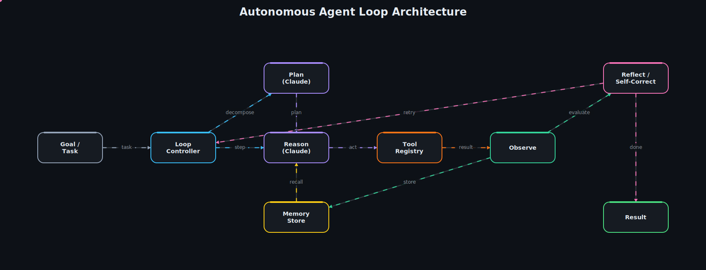

# Claude Autonomous Agents

**Five genuinely autonomous agent loops on Claude — built from scratch, no orchestration frameworks.** ReAct, plan-and-execute, reflexion (self-correction), memory-augmented, and multi-agent orchestration, all sharing one clean loop engine.



> 📽 A matching animated GIF is in [`assets/architecture.gif`](assets/architecture.gif).

## Overview

This repo is for the engineer who lives in agent development — not workflow automation. There's no Zapier/n8n/Make anywhere here. Every loop is hand-built on the **Claude API / Claude Agent SDK** primitives: multi-step reasoning, tool use, planning, reflection, memory, and self-correction, with the agent loop architected explicitly rather than assembled from no-code blocks.

It deliberately shows **variety within one domain**: the same shared core (`ClaudeClient`, `ToolRegistry`, memory stores, `BaseAgent`) powers five distinct autonomous strategies, so you can see both idiomatic loop engineering and a feel for when each pattern is the right tool.

## The five loops

| Loop | Pattern | What it demonstrates |
|------|---------|----------------------|
| **ReAct** (`react.py`) | reason → act → observe | The canonical from-scratch tool-use loop with a step budget and clean `tool_use` → `tool_result` round-trip. |
| **Plan-and-Execute** (`plan_execute.py`) | plan → run steps → synthesize | Task decomposition into a structured plan, then per-step execution with bounded scope. |
| **Reflexion** (`reflexion.py`) | draft → critique → revise | Self-correction: a critic turn scores the answer and feeds actionable feedback into the next attempt. |
| **Memory-augmented** (`memory_agent.py`) | recall → act → persist | Episodic + semantic memory so knowledge compounds across turns instead of dying with the context window. |
| **Multi-agent** (`orchestrator.py`) | route → delegate → merge | A supervisor delegating sub-tasks to specialist ReAct loops, then synthesizing their outputs. |

## Architecture walkthrough

The diagram mirrors the shared loop every strategy plugs into:

- **Goal → Loop Controller** — the entrypoint (`BaseAgent`) receives a task and owns the step budget, transcript, and tool round-trip.
- **Loop Controller → Plan / Reason (Claude)** — depending on the strategy, the controller asks Claude for a plan (`plan-execute`) or reasons a step at a time (`react`, `memory`). Adaptive thinking and effort are set once in `ClaudeClient`.
- **Memory Store → Reason** — the memory-augmented loop recalls relevant facts (`SemanticMemory.recall`) and injects them before reasoning; the recall seam is embedding/vector-DB-ready.
- **Reason → Tool Registry (Act)** — Claude emits `tool_use` blocks; `ToolRegistry.execute` dispatches to typed Python callables (calculator, web-search stub) and returns observations.
- **Act → Observe → Store** — observations feed back as `tool_result` blocks and are logged; the memory loop persists learnings here.
- **Observe → Reflect / Self-Correct** — the reflexion loop scores the result and either loops back to the controller (**retry**) or emits the final **Result**.

Each edge in the diagram corresponds to a real call site in the code — the seams are wired, not just described.

## Tech stack

- **Python 3.11+**
- **[Anthropic Python SDK](https://github.com/anthropics/anthropic-sdk-python)** — the Claude API, driven through a single `ClaudeClient` wrapper (streaming + adaptive thinking).
- **Claude Opus 4.8** (`claude-opus-4-8`) for the main loops, **Haiku 4.5** (`claude-haiku-4-5`) available for cheap sub-agents — configurable via env.
- **pytest** for unit tests; **ruff** for linting. No agent frameworks (LangGraph/AutoGen/CrewAI) — pure custom loop engineering, by design.

## Project structure

```
claude-autonomous-agents/
├── src/claude_agents/
│   ├── config.py              # env-driven settings (model, effort, step budget)
│   ├── cli.py                 # `python -m claude_agents.cli <loop> "<task>"`
│   ├── core/
│   │   ├── claude_client.py   # Anthropic SDK wrapper: streaming, thinking, tool round-trip
│   │   ├── agent.py           # BaseAgent: transcript, step budget, tool dispatch
│   │   ├── tools.py           # Tool + ToolRegistry + example tools (calculator, web_search)
│   │   └── memory.py          # EpisodicMemory + SemanticMemory (vector-DB-ready recall)
│   └── loops/
│       ├── react.py           # ReAct
│       ├── plan_execute.py    # Plan-and-Execute
│       ├── reflexion.py       # Reflexion / self-correction
│       ├── memory_agent.py    # Memory-augmented
│       └── orchestrator.py    # Multi-agent supervisor
├── tests/                     # tool registry, memory, ReAct control-flow (mocked client)
├── assets/                    # architecture spec + animated SVG/GIF
├── pyproject.toml
└── .env.example
```

## Getting started

**Prerequisites:** Python 3.11+ and an Anthropic API key.

```bash
# 1. Install (editable, with dev extras)
pip install -e ".[dev]"

# 2. Configure
cp .env.example .env
# edit .env and set ANTHROPIC_API_KEY

# 3. Run a loop (--trace prints every step)
python -m claude_agents.cli react "What is 128 * 47, and is that number prime?" --trace
python -m claude_agents.cli reflexion "Write a one-sentence summary of the CAP theorem."
python -m claude_agents.cli orchestrator "Research the boiling point of water at sea level, then convert it to Fahrenheit."

# List all loops
python -m claude_agents.cli --list
```

The Anthropic SDK resolves credentials from `ANTHROPIC_API_KEY` (or an `ant auth login` profile) — no key is ever hardcoded.

## Testing

```bash
pytest -q        # or: make test
```

Tests run **fully offline** — the ReAct control-flow test drives the loop with a scripted, mocked Claude client, proving the wiring (stop conditions, tool round-trip, step budget) without touching the network.

## Roadmap — what a full build adds

This is a focused, runnable starter. A production engagement would extend it with:

- **Real connectors** behind the stub seams — a search provider (Tavily/Brave), a vector store (pgvector/Qdrant) for `SemanticMemory.recall`, and durable memory persistence.
- **Streaming + observability** — token-level streaming to a UI, structured tracing (OpenTelemetry), per-run token/cost accounting from `usage`.
- **Server-managed agents** — porting the orchestrator to the Claude Agent SDK's Managed Agents for hosted sandboxes, session resumption, and MCP tool access.
- **Guardrails** — human-in-the-loop approval gates on side-effecting tools, prompt-injection defenses, and refusal/fallback handling.
- **Evaluation harness** — rubric-graded outcomes and regression suites per loop, so behavior changes are measured, not guessed.

---

*Starter architecture by Arpit Singh — Senior AI & Data Engineer.*
